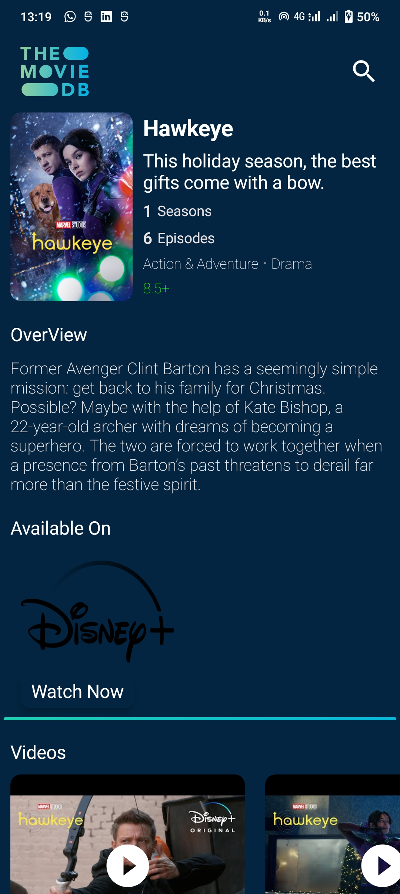

# TheMovieHub
You will get daily suggestions for upcoming movies and TV shows and their details in the app, such as a related trailer, images, and many more.

### Features
 1. Daily new movie recommendation
 2. Deatils of movie and TV shows.
 3. Images of related movies and TV shows
 4. Related videos
 5. Top movie casts.
 6. You can also search your movie, tv shows and about person.

# ScreenShots

    
    
    
    
    
    

    <a href = "https://github.com/nipun2003/TheMovieHub/raw/main/app/release/TMDB.apk"> Have a try </a>

 

# Api 
The API used for all actions in the app is  <a href = "https://developers.themoviedb.org/3/getting-started/introduction">The movie database</a>

# Contribution

### Prerequisite
 1. You must have android studio installed in your system.
 Install Android Studio <a href="https://developer.android.com/studio?gclsrc=ds&gclsrc=ds&gclid=CP2P7r6_-fQCFUe9jgod55kJmg">Here</a>
 
 2. Jetpack Compose
 3. Kotlin

### Open Source

 1. Fork the repository
 2. Create your feature branch

            git checkout -b YourBranchName
 3. Commit your changes
   
            git commit -m "Added some feature"
 4. Run your code
 5. Push your branch
   
            git push -u origin YourBranchName
 6. Create a new pull reqeust
